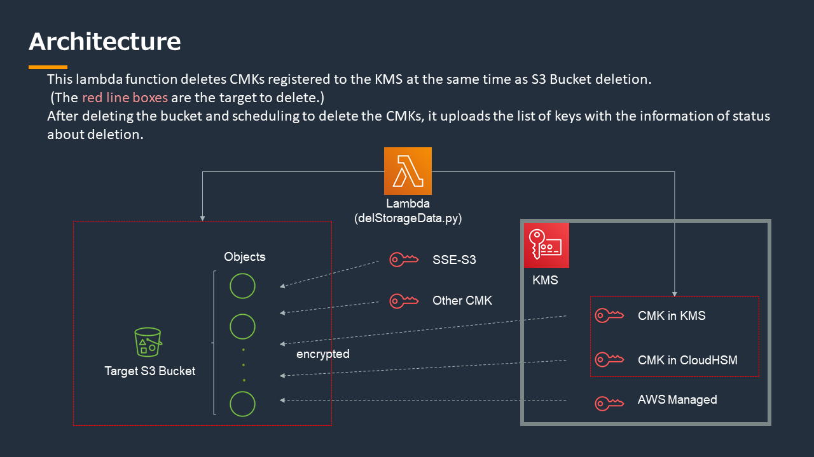

# lambda function "delStorageData"

[日本語(Japanese)](https://github.com/aws-samples/data-disposal-with-deleting-key-sample/blob/main/README_jp.md)

Schedule deletion of a KMS CMK associated with an object in S3 bucket at the same time as S3 bucket deletion.



# premise

the 4 following premise is needed to use the function:

1. There is an S3 bucket to delete in which encrypted objects are stored
```shell
<the target bucket name to delete>
```

2. There is a target key associated with the bucket <key to encrypt>

3. The key for signing has been created <key for signature>
```shell
<Key ID to sign at thekey list file>
```

4. S3 bucket created to store key list<bucket stored key list>
```shell
<the bucket name stored the file of key information and signature>
```

# build the lambda function : "delStorageData"

1. Create IAM roles and policy to attach (see json files in 02_iam folder respectively)
    - Create policy “policy_AWSKeyManagementServicesForDeletion”
    - Create role “role_dsd-role-lambda” for lambda with policy attached above

2. Create the lambda function
    - Configure the lambda function with the following two python code
        - delStorageData.py
        - lambda_handler.py
    - timeout: 5 minutes
    - memory: (dpend on the volume of the bucket to delete)

3. Run lambda function
    - Run lambda by entering data in the following json format
```
{
    "bucketName" : "<the target bucket name to delete>",
    "bucketNameStoredKeylist" : "<the bucket name stored the file of key information and signature>",
    "keyIdToSign" : "<Key ID to sign at thekey list file>",
    "filenameOfKeyList" : "<the filename for the file about key information>", ## need to set
    "digestFilePath" : "<the filename of digest for signature>", ## need to set
    "signatureFilePath" : "<the filename of signature>" ## need to set
}
```

!! This will delete the specified bucket and all objects and schedule the deletion of the CMKs used for encryption!!

# the procedure to verify the list of keys scheduled to delete

Make sure the hash (sha256) of the original file matches <digest file>
```shell
# <key list file> : "keyListAboutDeletedS3Bucket.dat"
# <digest file> : "digest.txt"
# <signature file> : "signature.binary"

$ sha256sum <key list file>
d4e120ff985bb3f0c220d1879f3868840d6dab3e4e2256a984d48eac2dee3742  keyListAboutDeletedS3Bucket.dat
$ cat digest.txt
d4e120ff985bb3f0c220d1879f3868840d6dab3e4e2256a984d48eac2dee3742
```

Verify that the <digest file> can be validated with the signature file that is stored with it
```shell
$ aws kms verify --key-id <key for signature> \
  --message-type RAW \
  --signing-algorithm ECDSA_SHA_256 \
  --message fileb://<digest file> \
  --signature fileb://<signature file>
```

Sample when verify succeeded
```shell
$ aws kms verify  --key-id alias/dsd-key-for-signature-ecc_secg_p256k1 --message-type RAW --signing-algorithm ECDSA_SHA_256  --message fileb://digest.txt --signature fileb://signature.binary
{
    "KeyId": "arn:aws:kms:us-east-1:*********:key/c30b398a-70a9-4a5a-902f-*******",
    "SignatureValid": true,
    "SigningAlgorithm": "ECDSA_SHA_256"
}
```
