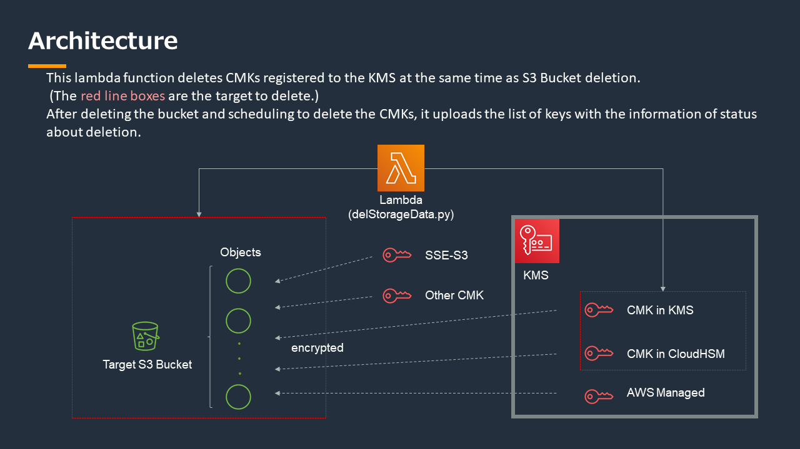

# delStorageData

S3 bucketのオブジェクトに紐づけられたKMSのCMKを、S3 bucket削除と同時に削除スケジューリングします。

**注：指定したS3 BucketとCMKが削除されてしまうため、テスト時に利用中のリソースは絶対に指定しないようご注意ください。**



# 前提

以下4つが前提になります。
1. 暗号化されたオブジェクトが保存された削除するS3バケットが存在する
```shell
# <bucket to delete> : dsd-backet-20200529r**

python createS3Bucket.py <bucket to delete>
```

2. バケットに紐づけられた対象キーが存在する<key to encrypt>
```shell
# <key to encrypt> : dsd-cmk-2020mmddr**

$ python prepareS3_CMK.py -b <bucket stored key list> -k <key to encrypt>
```

3. 署名用の非対象キーが作成済み<key for signature>
```shell
# <key for signature> : 'alias/dsd-key-for-signature-ecc_secg_p256k1'

$ python createCMK.py -k <key for signature> -s
```

4. キーリストを格納するS3バケットが作成済み<bucket stored key list>
```shell
# <bucket stored key list> : dsd-bucket-for-list-sotred

$ python createS3Bucket.py <bucket stored key list>
```

# delStorageData lambda 実装

1. IAMロールとアタッチするポリシーを作成(それぞれ02_iamフォルダ内のjsonファイルを参照)
    - ポリシー"policy_AWSKeyManagementServicesForDeletion"を作成する
    - 上記を含むポリシーをアタッチしたlambda用のロール"role_dsd-role-lambda"を作成する

2. lambda functionを作成
    - 以下２つのpython codeでlambda functionを構成する
        - delStorageData.py
        - lambda_handler.py
    - timeout : 5分
    - memory : (dpend on the volume of the bucket to delete)

3. lambda functionの実行
    - 以下のjsonフォーマットでデータを入力することで、lambdaを実行する。

```
{
    "bucketName" : "<the target bucket name to delete>", 
    "bucketNameStoredKeylist" : "<the bucket name stored the file of key information and signature>",
	"keyIdToSign" : "<Key ID to sign at thekey list file>",
    "filenameOfKeyList" : "<the filename for the file about key information>", ## need to set
    "digestFilePath" : "<the filename of digest for signature>", ## need to set
    "signatureFilePath" : "<the filename of signature>" ## need to set
}
```

!! この操作により、指定したバケットと全オブジェクトが削除され、暗号化に使われたCMKの削除スケジュールが設定されます。!!


# 検証方法

オリジナルファイルのハッシュ(sha256)が<ダイジェストファイル>と一致していることを確認
```shell
# <key list file> : "keyListAboutDeletedS3Bucket.dat"
# <digest file> : "digest.txt"
# <signature file> : "signature.binary"

$ sha256sum <key list file>
d4e120ff985bb3f0c220d1879f3868840d6dab3e4e2256a984d48eac2dee3742  keyListAboutDeletedS3Bucket.dat
$ cat digest.txt 
d4e120ff985bb3f0c220d1879f3868840d6dab3e4e2256a984d48eac2dee3742
```

ダイジェストファイルが一緒に保存されている署名ファイルで検証できることを確認
```shell
$ aws kms verify --key-id <key for signature> \
  --message-type RAW \
  --signing-algorithm ECDSA_SHA_256 \
  --message fileb://<digest file> \
  --signature fileb://<signature file>
```

成功している時の表示例
```shell
$ aws kms verify  --key-id alias/dsd-key-for-signature-ecc_secg_p256k1 --message-type RAW --signing-algorithm ECDSA_SHA_256  --message fileb://digest.txt --signature fileb://signature.binary
{
    "KeyId": "arn:aws:kms:us-east-1:*********:key/c30b398a-70a9-4a5a-902f-*******",
    "SignatureValid": true,
    "SigningAlgorithm": "ECDSA_SHA_256"
}
```

